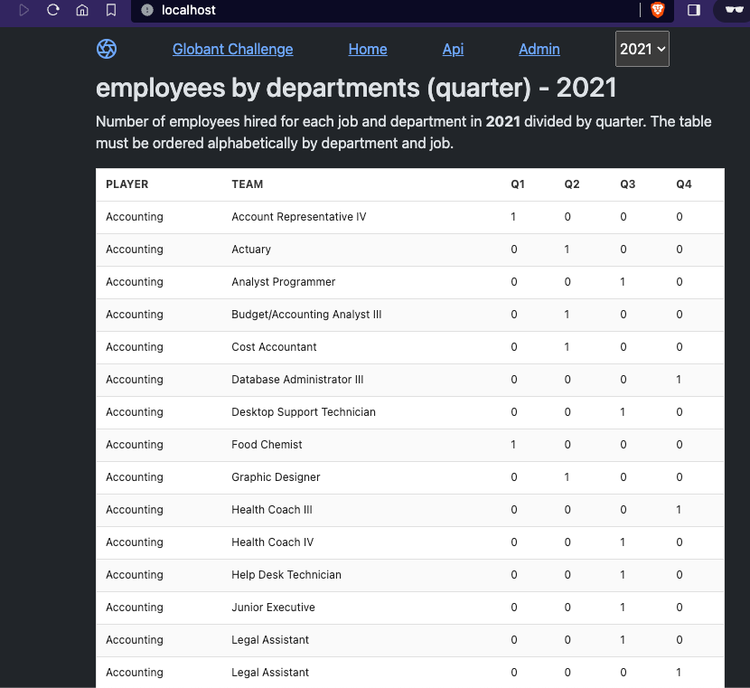

## run

```shell
docker-compose up --build
```
open this [link](http://localhost/) in a browser


## admin user

in the [admin](http://localhost/admin/) page.

- username: admin
- password: admin123
- email: adminxyz@admin.adm

## stack

- vue
- python
- django
- pandas
- docker